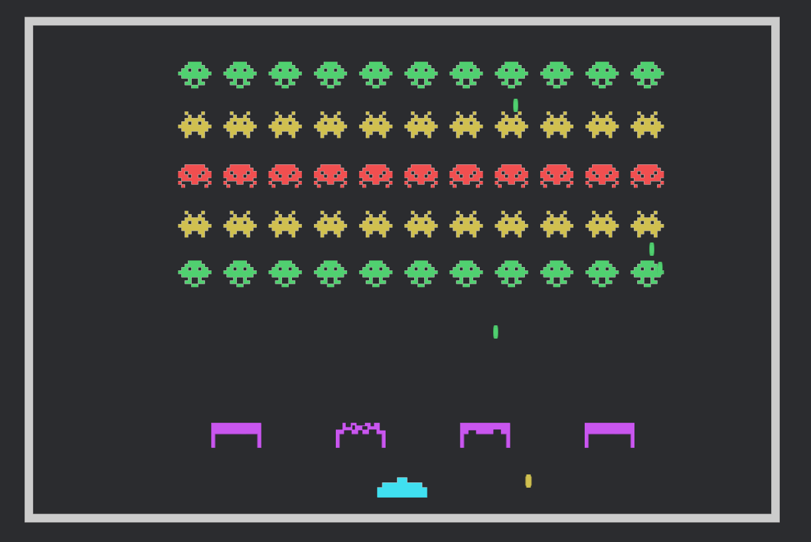

# bevy-invaders
Using my dev days to explore the Bevy Engine https://bevyengine.org/, https://bevyengine.org/learn/book/getting-started/

## How to run

Install rust and run ``cargo run`` in the main directory

## Resources

Sprites: https://opengameart.org/content/assets-for-a-space-invader-like-game

Audio: https://freesound.org/people/iut_Paris8/sounds/428638/, https://freesound.org/people/igramul/sounds/34617/